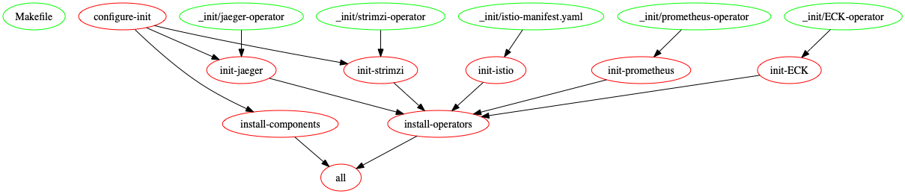

# Provision Trace-Grapher on Kubernetes

## Concept and Scope

## Makefile rules

All Makefile targets involved in the deployment of the application are present in the following DAG:

### Global Rules

- `make configure-init`
- `make wipe`
- `make purge`

### Apache Kafka Operator with Strimzi

- `make get-strimzi`: Download Strimzi K8S deployment files from GitHub into the `strimzi` directory.
- `make init-strimzi`: Apply the Strimzi Operator config to the Kubernetes Cluster.
- `make remove-strimzi`: Delete Strimzi Opertor from the Kubernetes Cluster.

### Jaeger Operator

- `make get-jaeger`: Download Jaeger Operator deployment files from Github into the `jaeger` directory.
- `make init-jaeger`: Apply the Jaeger Operator configuration to the Kubernetes Cluster.
- `make remove-jaeger`: Delete Jaeger Operator from the Kubernetes Cluster.

### Linkerd Service Mesh

- `make get-linkerd`: Download Linkerd executable and installs it locally in the `linkerd` directory.
- `make init-linkerd`: Applies Linkerd configuration to the Kubernetes Cluster to install Linkerd Service-Mesh.
- `make remove-linkerd`: Delete Linkerd Service Mesh from the Kubernetes Cluster.

## Problems encountered

While wiping the application on a K3S Cluster, the K8S namespace `trace-grapher` refuses to be deleted.
The command `kubectl delete -f operators/ECK/all-in-one.yaml` was struck, and the dashboard not responsive to manual deletions.
It turned out to be the some CRD that was not deleted properly and indefinitely wait for some `finalizers` to return [[source](https://github.com/kubernetes/kubernetes/issues/60538#issuecomment-369099998)].

> To manually remove the Kibana CRD finalizers that caused the issue on my app run `kubectl patch crd/kibanas.kibana.k8s.elastic.co -p '{"metadata":{"finalizers":[]}}' --type=merge`.

* * *
